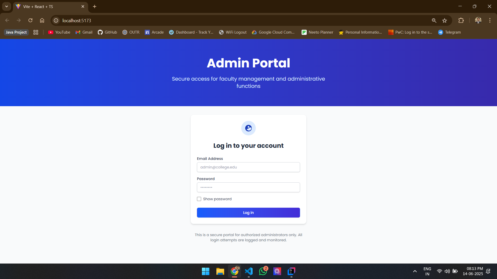
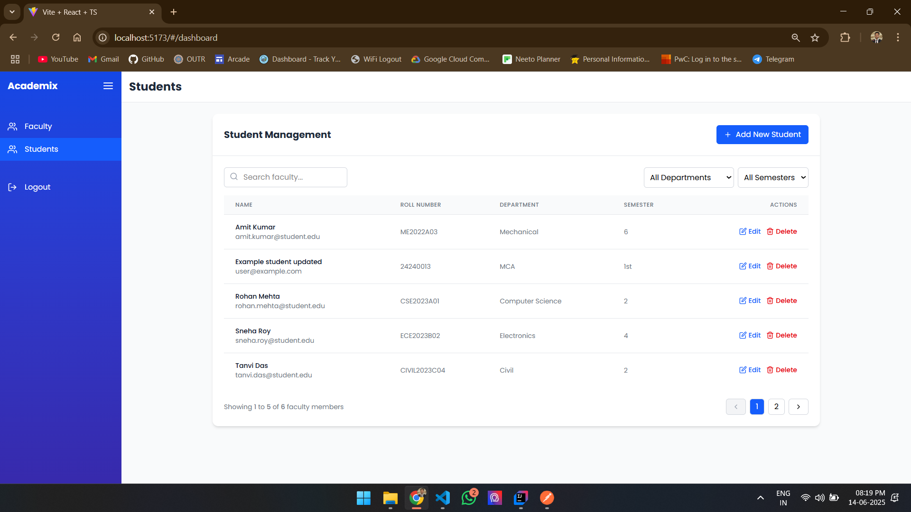
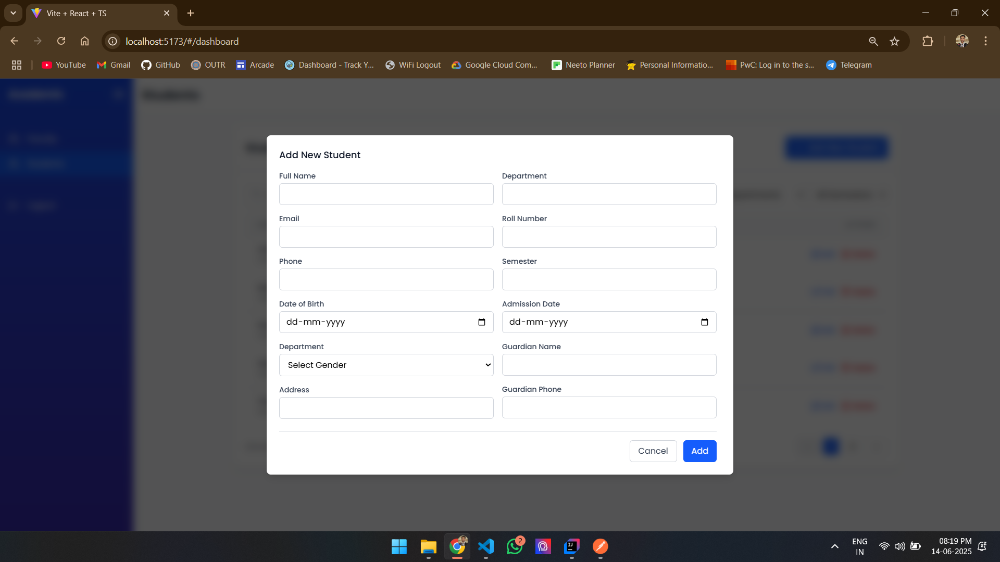
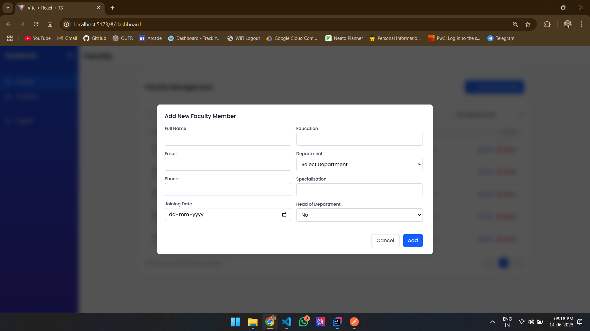

# 🎓 Academix

**Academix** is a modern and responsive student and faculty management dashboard built with **React.js**, **Tailwind CSS**, and **TypeScript**. It integrates seamlessly with the [Student Faculty Management Backend](https://github.com/Monalisa-XD/student-faculty-management-backend) to provide full CRUD functionality for managing users, students, and faculty records.

---

## 📸 Screenshots

### 🔐 Login Page



### 🎓 Students Dashboard



### 🧑‍🏫 Faculty Management


### ➕ Add/Edit Student Modal



### 📋 Add/Edit Faculty Modal



---

## 🔧 Tech Stack

- **React.js (Vite)**
- **TypeScript**
- **Tailwind CSS**
- **React Router DOM**

---

## 🌐 Features

- User registration & login (with password encryption on backend)
- View, add, update, and delete **Students**
- View, add, update, and delete **Faculty Members**
- Role-based form management (Admin use-case)
- Responsive UI with mobile support
- Integrated with Spring Boot backend via REST APIs

---

## 📁 Project Structure

```

src/
├── components/        # Reusable components (e.g., modals, buttons)
├── pages/             # Routes like Students, Faculties, Login, etc.
├── types/             # TypeScript interfaces for Students, Faculties
├── App.tsx            # Main application wrapper
└── main.tsx           # Entry point

````

---

## 🚀 Getting Started

### 1. Clone the repo

```bash
git clone https://github.com/Monalisa-XD/academix.git
cd academix
````

### 2. Install dependencies

```bash
npm install
```

### 3. Configure backend URL

Create a `.env` file and add:

```env
VITE_API_BASE_URL=http://localhost:8080
```

### 4. Run the app

```bash
npm run dev
```

The app will be available at: [http://localhost:5173](http://localhost:5173)

---

## 📡 API Integration

The app consumes REST APIs from the Spring Boot backend:

* `POST /login` – Authenticate users
* `POST /register` – Create new user accounts
* `GET/POST/PUT/DELETE /students` – Manage students
* `GET/POST/PUT/DELETE /faculty` – Manage faculty

> Ensure the backend is running on port `8080` before using the frontend.

---

## 📄 Type Definitions

### Student Interface

```ts
export interface Student {
  id: string;
  name: string;
  email: string;
  phone: string;
  department: string;
  rollNumber: string;
  admissionDate: string;
  semester: string;
  dob: string;
  gender: "Male" | "Female" | "Other";
  address: string;
  guardianName: string;
  guardianPhone: string;
}
```

### Faculty Interface

```ts
export interface Faculty {
  id: string;
  name: string;
  email: string;
  phone: string;
  department: string;
  specialization: string;
  education: string;
  isHod: boolean;
  joiningDate: string;
}
```

---

## 📬 Contact

For questions, suggestions, or contributions, feel free to open an issue or contact the developer.

* Backend Repo: [Student Faculty Management Backend](https://github.com/Monalisa-XD/student-faculty-management-backend)
* Frontend Repo: [Academix](https://github.com/Monalisa-XD/academix)
